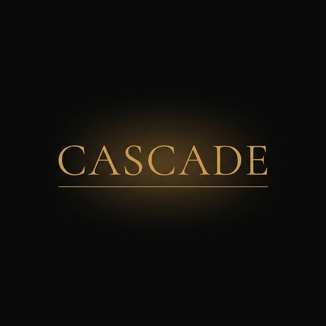

<p align="center">
  
</p>

<p align="center">
  <em>AI-powered research intelligence — web-native</em>
</p>

<p align="center">
  
  
  
  
</p>

---

<br />

<h3 align="center">🚧&nbsp;&nbsp;Coming Soon&nbsp;&nbsp;🚧</h3>

<p align="center">
  Cascade is being built in the open. <br />
  Star this repo to get notified when it launches.
</p>

<br />

---

## What is Cascade?

**Cascade** is a web-native research intelligence platform that helps researchers navigate the academic landscape with AI. Think of it as a research copilot that reads, connects, and synthesizes papers — so you can focus on the ideas that matter.

<br />

### ✦ &nbsp; Core Capabilities

| | Feature | Description |
|---|---|---|
| 🔍 | **Deep Research** | Ask complex research questions and receive comprehensive, citation-backed answers synthesized from the literature |
| 🕸️ | **Citation Graph Explorer** | Visualize paper relationships through interactive force-directed graphs — trace influence, find clusters, discover hidden connections |
| 📄 | **Paper Reader** | Drop any arXiv link, DOI, or PDF — Cascade extracts, summarizes, and lets you interrogate the full text |
| 📚 | **Literature Reviews** | Generate structured literature reviews with gap analysis, trend identification, and research opportunity mapping |
| 🧠 | **Persistent Memory** | Every paper you explore is remembered — building a personal knowledge graph that grows with your research |

<br />

### ✦ &nbsp; Architecture

```
cascade/
├── cascade/            # Python backend
│   ├── agent.py        # LLM-powered research agent
│   ├── engine.py       # Core orchestration engine
│   ├── graph.py        # Citation graph builder (NetworkX)
│   ├── reader.py       # Paper extraction (arXiv, PDF, web)
│   ├── semantic.py     # Semantic Scholar integration
│   ├── memory.py       # SQLite + ChromaDB persistence
│   ├── api/            # FastAPI endpoints
│   └── search/         # Multi-source academic search
│
├── web/                # Next.js frontend
│   └── src/
│       ├── app/        # Editorial brutalism UI
│       └── components/ # Graph view, input, streaming
│
└── tests/              # Test suite
```

<br />

### ✦ &nbsp; Built With

<p>
  
  
  
  
  
  
</p>

<br />

### ✦ &nbsp; Design Philosophy

Cascade's interface follows an **editorial brutalism** aesthetic — the precision of a typeset research journal meets the power of a modern research instrument. Built with [Cormorant Garamond](https://fonts.google.com/specimen/Cormorant+Garamond) for display and [JetBrains Mono](https://www.jetbrains.com/lp/mono/) for code, against a dark palette with warm amber accents.

<br />

---

<p align="center">
  <sub>Built by <a href="https://github.com/sarudoru">Sardor Nodirov</a></sub>
</p>

<p align="center">
  <sub>© 2026 Sardor Nodirov. All rights reserved.</sub>
</p>
